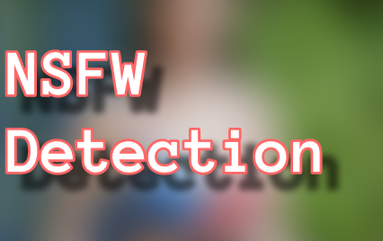

[](https://jitpack.io/#duy-maimanh/ml_task_vision)

# ML Task Vision!

**This library helps you solve common computer vision tasks by using On-device
machine learning. Such as blur NSFW images, censor faces, etc...**

#### Benefit

+ Privacy (We don't need to send sensitive user data to the server to process)
+ Low latency (Because we don't need to request the server and wait for the
  response)
+ Offline availability (We can use any feature without an internet connection)

## How to use

Add it in your *settings.gradle*:

```
dependencyResolutionManagement {  
  repositoriesMode.set(RepositoriesMode.FAIL_ON_PROJECT_REPOS)  
    repositories {  
   ...  
    maven { url 'https://jitpack.io' }  
 }}
 ```

Add the dependency:

```
dependencies {
    implementation 'com.github.duy-maimanh:ml_task_vision:0.0.2'
}
 ```

## Setup BaseOptions.

```
val options = BaseOptions.builder()  
    .isUseGPU(false)  
    .setNumberThreads(4)  
    .build()
 ```

The *setNumberThreads* is the settings for CPU which mean it only works when
the *isUseGPU = false*. But you should set it because some devices do not
support GPU so they will use CPU instead.

# 1. NSFW detection



This is the very first library feature. That helps us to detect the image and
know if it is NSFW or safe for work. It is useful for kind of apps like social
media, chatting, or dating... The accuracy now is around 88% based on 8100 test
images. And I continue collecting datasets and training this model and will be
updated when I got higher accuracy.

## Download model

There are two ways to download models.

### 1. Download manually.

Download [the model](https://github.com/duy-maimanh/ml_task_vision/releases/download/0.0.2/nsfw_classifier.tflite)
and [the label](https://github.com/duy-maimanh/ml_task_vision/releases/download/0.0.2/nsfw_labels.txt)
. And copy these files to *src/main/asset*
folder.

### 2. Create *Gradle task* to auto download.

Open project-level build.gradle. Add *de.undercouch:gradle-download-task:4.1.2*

```
buildscript {
    dependencies {
        ...
        classpath 'de.undercouch:gradle-download-task:4.1.2'
    }
}
```

Create *download_model.gradle* at *app* folder. And copy the code below.

```
task downloadNSFWModel(type: Download) {
    src 'https://github.com/duy-maimanh/ml_task_vision/releases/download/0.0.2/nsfw_classifier.tflite'
    dest project.ext.ASSET_DIR + '/nsfw_classifier.tflite'
    overwrite false
}
task downloadNSFWLabel(type: Download) {
    src 'https://github.com/duy-maimanh/ml_task_vision/releases/download/0.0.2/nsfw_labels.txt'
    dest project.ext.ASSET_DIR + '/nsfw_labels.txt'
    overwrite false
}

preBuild.dependsOn downloadNSFWModel, downloadNSFWLabel
```

Move to app-level build.gradle. Apply the plugin and the download task.

```
apply plugin: 'de.undercouch.download'

android {
   ...
}

// import DownloadModels task
project.ext.ASSET_DIR = projectDir.toString() + '/src/main/assets'

apply from:'download_model.gradle'

dependencies {
   ...
}
```

## NsfwProcessOptions

```
val nsfwProcessOptions = NsfwProcessOptions.builder()  
    .setBaseOptions(options) // if you don't use BaseOptions skip this line. 
    .setFilterMode(FilterMode.BLUR, 0.0) // The larger the number, the more blurred the image. 
    .build()
 ```

## Create Nsfw Processer

```
val nsfwProcess = NsfwProcess.create(context, nsfwProcessOptions)
```

## Detect

```
val result = nsfwProcess.detect(uri)
```

or

```
val result = nsfwProcess.detect(bitmap)
```

The result contains the confidence of each label (safe and unsafe) and the
filtered image.

## NSFW Detection Benchmark

Run benchmark with image 583*640 and loop for 50 times and get the average
running time:

|                    | Samsung A52 (Snapdragon 720G) |
|--------------------|-------------------------------|
| GPU                | 78ms                          | 
| CPU with 4 threads | 425ms                         |

# 2. Face censor

(Coming soon)

# 3. Background segmentation

(Coming soon)
